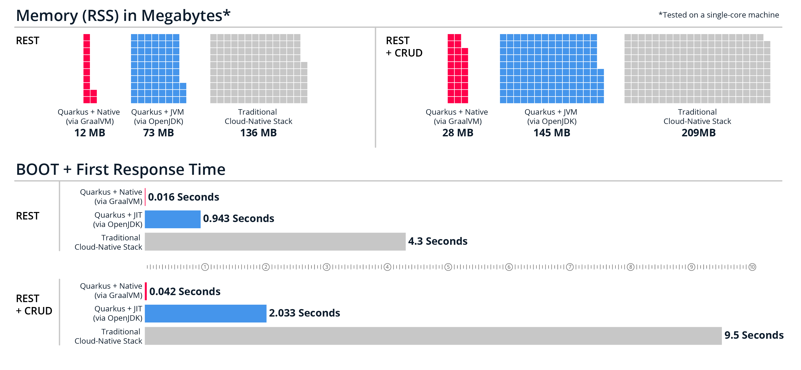
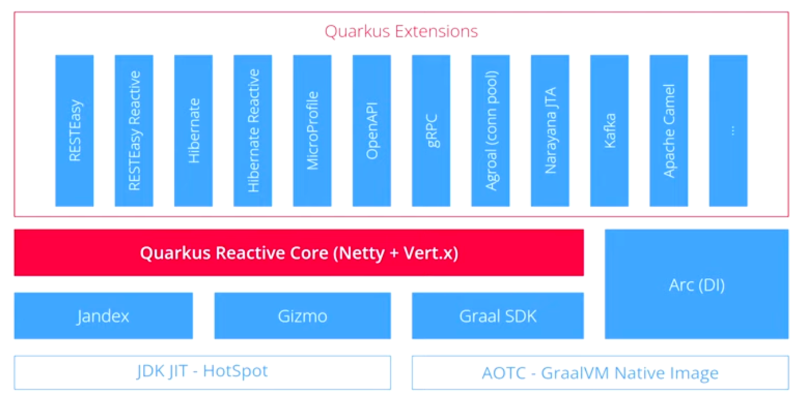

<!-- .slide: class="transition bg-pink" -->
# Pre-requisites

##==##
<!-- .slide: class="exercice" -->
# Check your setup

## Lab
**Goal** : Verify pre-requisites

[👉 Lab 0](https://github.com/sfeir-open-source/sfeir-school-quarkus/blob/main/steps/00-prerequisites/README.md)

Notes:
tanguy

##==##
<!-- .slide: class="transition bg-pink" -->

# Quarkus


##==##
<!-- .slide: class="with-code" -->
# Why Quarkus ? 

- Java 25+ years
- Applications no longer runs on big machines
- Density is the new optimization
- Quarkus team work with GraalVM for native build
- **Goal** : Make Java the leading platform for cloud applications
<!-- .element: class="list-fragment" -->

Notes:<br>
tanguy
Java ecosystem need to be modernized to fit the new way of deploying applications

##==##
<!-- .slide: class="with-code" -->

# Quarkus Features

- Container First
- Unifies imperative and reactive
- Community and standards
- Kubernetes native
- Developer Joy
<!-- .element: class="list-fragment" -->

Reference: https://quarkus.io/
<!-- .element: class="credits" -->

Notes:
tanguy
Tailored for GraalVM and HotSpot
Unifies imperative and reactive : both in the same application

##==##
<!-- .slide: class="with-code" -->
# Quarkus Features
## Benefit No. 1 : Container First

- Optimized for low memory usage
- Fast startup times
- Build Time processing
- Reduction in Reflection Usage
- GraalVM Native images support
- Native image preboot
<!-- .element: class="list-fragment" -->

Reference: https://quarkus.io/container-first/
<!-- .element: class="credits" -->

Notes:<br>
nathan
Do at build-time what is usually done at runtime
Avoid reflection and dynamic proxies
ArC determines the injection graph at build time
Native image preboot : the native executable has already run most of the startup code, 
the result is serialized into the executable

##==##

<!-- .slide: class="with-code" -->
# Quarkus Features
## Build time details


<!-- .element: class="list-fragment" -->

References :
https://quarkus.io/
##==##
<!-- .slide: class="with-code" -->

# Quarkus Features
## quarkus performance





<!-- .element: class="list-fragment" -->
Reference: devoxx 2022

<!-- .element: class="credits" -->
Notes:<br>
quantity of RAM used 
Resident State Side
##==##
# Quarkus Features
## Architecture




<!-- .element: class="credits" -->
Notes:<br>
Jandex : index of classe
Gizmo : generate byte code
Graal SDK : Graal compiler
##==##
<!-- .slide: class="with-code" -->
# Quarkus Features
## last release

* 26 april 2023, Quarkus 3.0.1Final are released
* many change are coming, for example
  * support Jakarta 10 (instead of Quarkus 2 support jakarta 8)
    * CDI Lite
    * Build optimization
* Hibernate ORM 6.2 (instead of 5 for quarkus 2)
* new dev ui
* support maven 9 (minimal 3.8.2)
* ```java
  quarkus deploy
  mvn quarkus:deploy
  ```
<!-- .element: class="list-fragment" -->


References :
https://quarkus.io/blog/quarkus-3-0-final-released/
##==##
<!-- .slide: class="with-code" -->
# Quarkus Features
## Benefit No. 2 : Imperative and reactive

- Http Service
- gRPC
- GraphQL
- Event-driven with Reactive Messaging
- Functions as a Service with Funqy
<!-- .element: class="list-fragment" -->


References :
https://quarkus.io/continuum/ and 
https://quarkus.io/guides/quarkus-reactive-architecture
<!-- .element: class="credits" -->


Notes:<br>
tanguy
Client / server is not the only model anymore : 
HTTP microservices, reactive applications, event-driven architectures, serverless

##==##
<!-- .slide: class="with-code" -->
# Quarkus Features
## Benefit No. 3 : Community and standards

OpenSource<br>
<br>
Built on top of proven standards

- CDI for dependency injection
- JAX-RS annotations for REST endpoints
- JPA for persistent entities
- JTA for transactions boundaries
- Eclipse MicroProfile to configure and monitor
- and much more<br>
<!-- .element: class="list-fragment" -->


Reference: https://quarkus.io/standards/
<!-- .element: class="credits" -->

Notes:<br>
nathan
Quarkus is not just a consumer it also aims to improve and contribute to existing technologies

##==##
<!-- .slide: class="with-code" -->
# Quarkus Features
## Benefit No. 4 : Kube-Native

- Single step deployment with Kubernetes extensions
- Extensions to deploy serverless microservices
- OpenTracing to debug distributed microservices
- Health and Metrics : SmallRyeHealth and Micrometer
- Extension to use Kube ConfigMap and Secrets as configuration source
- Remote Development
<!-- .element: class="list-fragment" -->

Reference : https://quarkus.io/kubernetes-native/
<!-- .element: class="credits" -->

Notes:<br>
tanguy
Extensions for Kubernetes that simplifies the deployment<br>
Remote dev to live code, all changes made locally will be visible in the cluster environment

##==##
<!-- .slide: class="with-code" -->
# Quarkus Features
## Benefit No. 5 : Developer Joy

- Live Coding
- Unified Config 
- Opinionated
- Dev UI
- Dev Services
- Continuous Testing
- Command Line Interface
<!-- .element: class="list-fragment" -->

Reference : https://quarkus.io/developer-joy/
<!-- .element: class="credits" -->

Notes:<br>
tanguy
A single config file<br>
DevServices automatic provisioning 

##==##
<!-- .slide: class="transition bg-pink" -->

# First micro-service

##==##
<!-- .slide: class="with-code" -->
# Content for this first micro-service

Notes:<br>
tanguy

##==##
<!-- .slide: class="exercice" -->
# Init module
## Lab

**Goal** : Initialize the first micro-service

[👉 Lab 1](https://github.com/sfeir-open-source/sfeir-school-quarkus/blob/main/steps/01.01-init-character-module/README.md)

